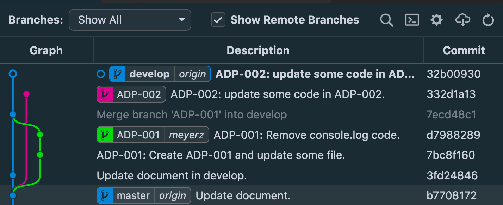

# Git - 日常开发
{docsify-updated}

> 简单介绍 CoverMore 日常开发用到的git命令, 主要用到分支有 master、develop、ADP-001、ADP-002。 （ ADP- 是 feature 分支）


<section>

## Git 基础操作
拉取远程分支
```bash
git checkout --track origin/master
```
### 分支 master

现在只有一个主分支 master ，master 不能直接推送代码。


### 创建 develop

我们需要基于 master 创建一个 develop 分支

```bash
git branch develop
```

 从图形界面上可以看到新增一个 develop 分支。


### 切换 develop

但是我们现在仍在 master 分支，需要切换到 develop 分支：

```bash
git checkout develop
切换到分支 'develop'

# git switch develop 也可以切换分支.
```


从图形界面上可以看到，develop移动到了最左边，说明我们切换到了 develop 分支。

> 创建分支 和 切换分支 可以合并成 `git checkout -b develop`

```bash
git chekcout -b develop # 从当前分支检出 develop
git checkout -b develop master # 从 master 检出 develop
```

develop分支上一般也不直接推送代码。

### 提交代码

因为 develop 和 master 在同一个节点上，我们需要在 develop 上提交一些代码来区分master.

修改代码后 查看状态

```bash
git status

位于分支 develop
尚未暂存以备提交的变更：
  （使用 "git add <文件>..." 更新要提交的内容）
  （使用 "git restore <文件>..." 丢弃工作区的改动）
        修改：     docs/00git-daily.md

修改尚未加入提交（使用 "git add" 和/或 "git commit -a"）
```

暂存所有修改的文件

```bash
git add .
```

再次查看状态

```bash
git status

位于分支 develop
要提交的变更：
  （使用 "git restore --staged <文件>..." 以取消暂存）
        修改：     docs/00git-daily.md
```

提交暂存代码

```bash
git commit -m "Update document in develop."

[develop 3fd2484] Update document in develop.
 1 file changed, 3 insertions(+)
```

再次查看状态

```bash
git status

位于分支 develop
无文件要提交，干净的工作区
```

查看已提交的代码变更

```bash
git show # 查看最新一次修改
git log -p # 常看历史log 的文件修改
```


↑ *终端截图* 常规的代码提交连招

经过一系列操作 我们来看一下图形界面


可以看到 develop 前进了一个节点。

> **总结一下**
>
> 虽然 develop 检出自 master，但是伴随着开发很多时候 develop 和 master 不在一个节点上， develop 会后很多新的代码提交。后面会遇到
>
> - 基于 develop 创建开发分支 ADP-001
> - 基于 master 创建开发分支 ADP-002
>
> 基于不同分支创建开发分支 修改代码的git操作会有所不同。


完成的代码，首先要进行本地的测试。

推送到 origin/develop 部署到 DEV 环境 进行测试。

```bash
git push origin develop
```

推送到自己 fork 的 github 仓库。

```bash
git push meyerz ADP-001
```

### 创建PR

	1. 进入fork的仓库，点击 Pull request ，
	1. 设置仓库和分支，
	1. 点击 Create pull request 完成创建。


↑ *Github Create pull request 页面，经过ps的*

> **注意：** 记得把 PR url 地址， 写到对应 Ticket： ADP-001 的 **Deployment Steps** 里。


## 场景模拟 - 常规流程
### 创建 ADP-001

我们直接基于 master 创建开发分支 ADP-001：

```bash
git checkout -b ADP-001 master
切换到一个新分支 'ADP-001'
```


↑ *图形界面*

可以看到新增的 ADP-001 和 master 是在同一个节点。因为 ADP-001 在最左边 所以我们在 ADP-001 分支上。

> Tip:
>
> 命令 `git branch -vv` 可以用来查看 对应的远端分支。
>
> 命令 `git reflog show ADP-001` 查看分支历史

查看分支对应远端分支 我常用的是：

```bash
git status -sb
```


### 提交 ADP-001

在ADP-001上提交一些代码。

常规提价命令

```bash
git add .
git commit -m "ADP-001: Create ADP-001 and update some file."
```

如果没有增删文件，只是修改原有的文件, 可以合并为一个命令

```bash
git commit -am "ADP-001: Remove console.log code."
```


↑*图形界面: 位于 ADP-001*


↑ *图形界面: 位于 develop*

比较在不同分支对应的图形界面区别，空心圆表示当前所在的分支。


### Merge `ADP-001` Into `develop`

将 ADP-001 合并进 develop 我们需要执行命令：

```bash
git checkout develop
# 切换到分支 'develop'

git merge ADP-001
# [develop 7ecd48c] Merge branch 'ADP-001' into develop
```


合并 ADP-001 之后的图形界面


### 推送到 origin/develop

当前本地位于 develop 分支，首先来看下 develop 的远端分支

```bash
git branch -vv
```


可以看出 除了 master 有对应的远端 分支 [origin/master], 其它分支都是没有对应远端分支。

我们也可以使用命令

```bash
git status -sb
```


分别位于 master 和 develop 执行 `git status -sb` 查看当前分支对应的远端分支。


下面我们执行推送命令 push：

```bash
git push origin develop -u
```

上述命令推送到远程仓库的 develop 分支。

 `-u`  作用是将 分支 'develop' 设置为跟踪 'origin/develop'。


至此部署dev环境的git操作结束。


### 推送到 fork 仓库 创建 Pr

```bash
git checkout ADP-001
# 切换到分支 'ADP-001'

git status -sb
## ADP-001

git push meyerz ADP-001 -u  # 推动到远端 fork 仓库
```


代码推送完成，后续操作进入 github fork 仓库页面完成 Pr 创建即可。


最后来看一下图形界面


拿来合并ADP-001 的图形界面 做一下对比


可以观察到 develop 和 ADP-001 右边分别 多出了 *origin* 和 *meyerz* 就是我们设置对应的 远端仓库, master 一直就设置着远端仓库 origin。


> **总结**
>
> 上述是一个比较顺利的Git流程。

</section>


## 场景模拟 - 进阶命令

现在我们用 ADP-002 来演示进阶流程，回顾一下我们大致会经历的git操作有：

- 创建分支
- 提交代码
- 合并代码
- 部署 DEV 环境 ➜ 推送代码到 origin/develop
- 创建 Pr ➜ 推送代码到 meyerz/ADP-002


### 创建 ADP-002

这次我们可以直接从 origin/master 检出 ADP-002:

```bash
git checkout -b ADP-002 origin/master

# 分支 'ADP-002' 设置为跟踪 'origin/master'。
# 切换到一个新分支 'ADP-002'
```


从图形界面可以看到 ADP-002、master、 origin/master, 2个本地和1个远端分支都处于一个节点。


### 提交 ADP-002

我们随意的做一下代码修改，然后提交代码

```bash
git add .
git commit -m "ADP-002: update some code in ADP-002."
```


↑ 提交ADP-002 的图形界面。


### 合并 ADP-002

切换代码到 develop

```bash
git checkout develop
```

因为在 ADP-002 只有一个提交，我们可以将这个提交捡取到develop

```bash
# 位于 develop
git cherry-pick ADP-002 # 将ADP-002 最新的提交 拿到 develop 上
```


↑ 图形界面

可以看到 cherry-pick 不像 merge 会把 commit 连接 到 develop 上，而是拷贝了一个commit，重新给了 develop。

另外可以看到 develop 前进一个节点 和 origin/develop 分开了。


### 部署 DEV 环境

现在 ADP-002 代码已经在develop，本地测试没问题，可以直接推送远端仓库

```bash
git status -sb
## develop...origin/develop [领先 1]
```


我会习惯性的查看一下远端的状态，然后再推送

```bash
git push
```

因为已经设置了远端仓库 所以直接 `git push` 推送代码就可以了。



↑ 图形界面

 推送完之后可以看到 develop 和 origin/develop 又保持在同一个节点上。


### 创建 Pr

创建 pull request 需要先把代码推送到自己 fork 的仓库上

```bash
git checkout ADP-002
# 切换到分支 'ADP-002'
# 您的分支领先 'origin/master' 共 1 个提交。
#  （使用 "git push" 来发布您的本地提交）

git status -sb
## ADP-002...origin/master [领先 1]

git push meyerz ADP-002 -u # 重新设置远端分支

枚举对象中: 31, 完成.
对象计数中: 100% (31/31), 完成.
使用 16 个线程进行压缩
压缩对象中: 100% (25/25), 完成.
写入对象中: 100% (25/25), 2.09 MiB | 424.00 KiB/s, 完成.
总共 25（差异 3），复用 0（差异 0），包复用 0
remote: Resolving deltas: 100% (3/3), completed with 3 local objects.
remote:
remote: Create a pull request for 'ADP-002' on GitHub by visiting:
remote:      https://github.com/MeyerZhao-lab/git-cheat-sheet/pull/new/ADP-002
remote:
To github2.com:MeyerZhao-lab/git-cheat-sheet.git
 * [new branch]      ADP-002 -> ADP-002
分支 'ADP-002' 设置为跟踪 'meyerz/ADP-002'。
```

注意：因为我们的ADP-001检出自 origin/master ,所以不可以直接 `git push`, 需要明确指定远程分支并设置 `git push meyerz ADP-002 -u`

> `git branch -vv` 可以查看branch列表对应上游分支


 ↑ 图形界面

现在ADP-002 也有对应的远端分支

至此 进阶命令结束


## 场景模拟 - 情景 --no-ff

### 创建 hotfix-001 分支

```bash
git checkout -b hotfix-001
```


### 提交 hotfix-001

```bash
git add .
git commit -m "hotfix-001: fix some issue."
```


### 合并 hotfix-001

#### 直接合并 hotfix-001 到 develop

```bash
git checkout develop
git merge hotfix-001
# 更新 32b0093..612f97f
# Fast-forward
```


↑ 图形界面

develop 会直接 Fast-forward 合并，不会创建 合并commit。

> 使用命令 `git reset origin/develop --hard` 返回合并之前的代码。


#### 合并 hotfix-001 到 develop 带上  `--on-ff`

重新合并 hotfix-001，这次我们带上参数 `--on-ff`

```bash
git merge hotfix-001 --no-ff
```


↑ 图形界面

这次合并会再创建一个 Merge commit。目前看起来好像没有什么太大意义。


#### 直接合并 hotfix-001到 master

```bash
git checkout master
git merge hotfix-001
# 更新 b770817..612f97f
# Fast-forward
```


↑ 图形界面

直接合并进 mater，可以看到也是一个 Fast-forward 合并，Graph 没有发生变化，只是master 向前移动了节点。

>  使用命令 `git reset origin/master --hard` 返回合并之前的代码。


#### 合并 hotfix-001 到 master 带上  `--on-ff`

```bash
git checkout master
git merge hotfix-001 --no-ff
# Merge made by the 'ort' strategy.
```


↑ 图形界面

现在这个图形界面在后期溯源问题的时候就很容易返现 有个hotfix--001 同时提交到了develop 和 master。

<section>


## 常见命令的 实用选项

```bash
git status -s # 状态简览
```

### 查看已暂存和未暂存的修改

```bash
git status
git diff
git diff --staged
```

### git log

一个常用的选项是 `-p`，用来显示每次提交的内容差异。 你也可以加上 `-2` 来仅显示最近两次提交

```bash
git log -p
git log -p -2
```

比如说，如果你想看到每次提交的简略的统计信息，你可以使用 `--stat` 选项

```bash
git log --stat
```


### 撤消对文件的修改

```bash
git checkout -- CONTRIBUTING.md
```


## 远程仓库操作

### 添加远程仓库

```bash
git remote # 查看远程分支只有名字
git remote -v # 查看远程分支名字和地址

git remote add meyerz [your_Fork_repo_url ]
```

### 查看远程仓库

```bash
git remote show origin
```

### 远程仓库的移除与重命名

例如，想要将 `origin` 重命名为 `upstream`，可以用 `git remote rename` 这样做：

```bash
git remote rename origin upstream
```

移除一个远程仓库

```bash
git remote rm origin
```


## 打标签

### 列出标签

在 Git 中列出已有的标签是非常简单直观的。 只需要输入 `git tag`：

```bash
git tag
```


## 推送

```bash
git push origin ADP-001

git push origin ADP-001:ADP-001
# 把本地的ADP-001 推送到远端的ADP-001
```

如果并不想让远程仓库上的分支叫做 `ADP-001`

可以使用命令

```bash
git push origin ADP-001:ADP-001-wip
```

来将本地的 `ADP-001` 分支推送到远程仓库上的 `ADP-001-wip` 分支。


## 跟踪分支

```bash
$ git checkout --track origin/serverfix
Branch serverfix set up to track remote branch serverfix from origin.
Switched to a new branch 'serverfix'
```


```bash
$ git checkout -b sf origin/serverfix
Branch sf set up to track remote branch serverfix from origin.
Switched to a new branch 'sf'
```


```bash
$ git branch -u origin/serverfix
Branch serverfix set up to track remote branch serverfix from origin.
```

```bash
$ git branch -vv
  iss53     7e424c3 [origin/iss53: ahead 2] forgot the brackets
  master    1ae2a45 [origin/master] deploying index fix
* serverfix f8674d9 [teamone/server-fix-good: ahead 3, behind 1] this should do it
  testing   5ea463a trying something new

```


### 删除远程分支

如果想要从服务器上删除 `serverfix` 分支，运行下面的命令：

```bash
$ git push origin --delete serverfix
To https://github.com/schacon/simplegit
 - [deleted]         serverfix

```


## 变基


只提交 C8 和 C9 ：

```bash
git rebase --onto master server client # rebase master 移除server之后 的 client
```

以上命令的意思是：“取出 `client` 分支，找出处于 `client` 分支和 `server` 分支的共同祖先之后的修改(也就是client 上 C3 之后的修改 也就是 C8 和C9)，然后把它们在 `master` 分支上重放一遍”。这理解起来有一点复杂，不过效果非常酷。


### 提交区间

```bash
$ git log --no-merges issue54..origin/master
```

`issue54..origin/master` 语法是一个日志过滤器，要求 Git 只显示所有在后面分支（在本例中是 `origin/master`）但不在前面分支（在本例中是 `issue54`）的提交的列表。 我们将会在 [提交区间](https://www.progit.cn/#_commit_ranges) 中详细介绍这个语法。


### merge --squash

```bash
git merge --squash featureB
```

`--squash` 选项接受被合并的分支上的所有工作，并将其压缩至一个变更集，使仓库变成一个真正的合并发生的状态，而不会真的生成一个合并提交


### 检出远程分支

```bash
$ git remote add jessica git://github.com/jessica/myproject.git
$ git fetch jessica
$ git checkout -b rubyclient jessica/ruby-client
```

对于非持续性的合作，如果你依然想要以这种方式拉取数据的话，你可以对远程版本库的 URL 调用 `git pull` 命令。 这会执行一个一次性的抓取，而不会将该 URL 存为远程引用

```bash
$ git pull https://github.com/onetimeguy/project
From https://github.com/onetimeguy/project
 * branch            HEAD       -> FETCH_HEAD
Merge made by recursive.

```

### 确定引入了哪些东西

一般来说，你应该对该分支中所有 master 分支尚未包含的提交进行检查。 通过在分支名称前加入 `--not` 选项，你可以排除 master 分支中的提交。 这和我们之前使用的 `master..contrib` 格式是一样的

```bash
$ git log contrib --not master
commit 5b6235bd297351589efc4d73316f0a68d484f118
Author: Scott Chacon <schacon@gmail.com>
Date:   Fri Oct 24 09:53:59 2008 -0700

    seeing if this helps the gem

commit 7482e0d16d04bea79d0dba8988cc78df655f16a0
Author: Scott Chacon <schacon@gmail.com>
Date:   Mon Oct 22 19:38:36 2008 -0700

    updated the gemspec to hopefully work better
```

如果要查看每次提交所引入的具体修改，你应该记得可以给 `git log` 命令传递 `-p` 选项，这样它会在每次提交后面附加对应的差异（diff）。


### 三点语法

```bash
$ git diff master...contrib
```


### 变基与拣选工作流

为了保持线性的提交历史，有些维护者更喜欢在 master 分支上对贡献过来的工作进行变基和拣选，而不是直接将其合并。


## 提交区间

### 双点


↑ *Figure 137. Example history for range selection.*

```bash
$ git log master..experiment
D
C
```

显示 在 experiment 分支中而不在 master 分支中的提交

### 多点

```bash
$ git log master...experiment
F
E
D
C
```

### --left-right

`log` 命令的一个常用参数是 `--left-right`，它会显示每个提交到底处于哪一侧的分支。 这会让输出数据更加清晰。

```bash
$ git log --left-right master...experiment
< F
< E
> D
> C
```


## 清理工作目录

对于工作目录中一些工作或文件，你想做的也许不是储藏而是移除。 `git clean` 命令会帮你做这些事。

你需要谨慎地使用这个命令，因为它被设计为从工作目录中移除未被追踪的文件。 如果你改变主意了，你也不一定能找回来那些文件的内容。 一个更安全的选项是运行 `git stash --all` 来移除每一样东西并存放在栈中。


## 创建分支 <small class="opacity-25 fw-light">Create branch</small>

### 基于 origin/master 创建 ADP-001 分支

```bash
git branch ADP-001 origin/master
git checkout ADP-001
# git switch ADP-001 也可以切换分支。

→ 分支 'ADP-001' 设置为跟踪 'origin/master'
```
> This step and the next one could be combined into a single step with `checkout -b ADP-001 origin/master`.


</section>


## 部署dev <small class="opacity-25 fw-light">Deploy dev</small>


## 拉取请求 <small class="opacity-25 fw-light">Pull request</small>


