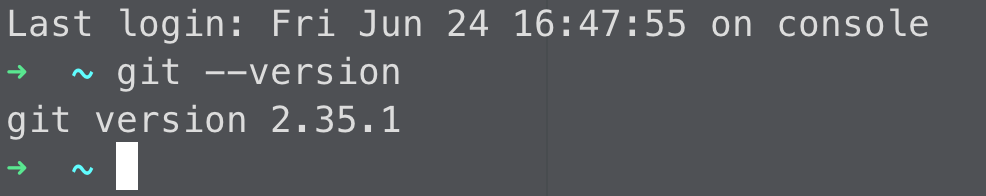

# 初学者
> {docsify-updated}

**安装教程:** [Bitbucket](https://www.atlassian.com/git/tutorials/install-git#mac-os-x)


## 首次安装
安装完 Git 打开终端并输入一下命令验证是否安装成功 `git --version`

```bash
git --version
```



使用下面配置您的 Git 用户名和电子邮箱。

```bash
git config --global user.name "Meyerz"
```

```bash
git config --global user.email "meyerz@ciandt.com"
```

配置好用户名和电子邮箱后可以使用下面命令检查：

```bash
git config --global --list
git config --global user.name
git config --global user.email
```

## 生成 SSH 密钥
1. 执行以下命令开始创建密钥

```bash
ssh-keygen -t rsa -b 4096 -C "your_email@example.com"
```
此命令将使用电子邮件作为标签创建新的 SSH 密钥

2. 然后会提示您“输入要保存密钥的文件”。
您可以指定文件位置或按“Enter”接受默认文件位置。

3. 下一个提示将要求输入安全密码。
密码短语将为 SSH 添加额外的安全层，并且在使用 SSH 密钥时需要。如果有人可以访问存储私钥的计算机，他们也可以访问使用该密钥的任何系统。向密钥添加密码可以防止这种情况发生。