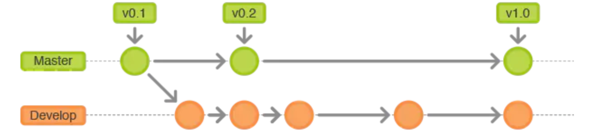
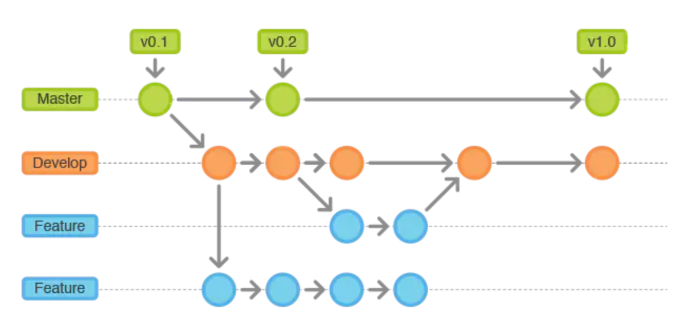
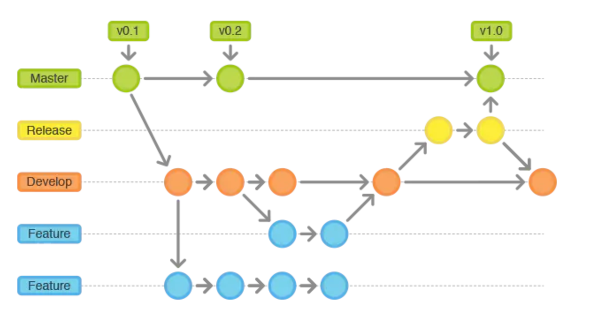
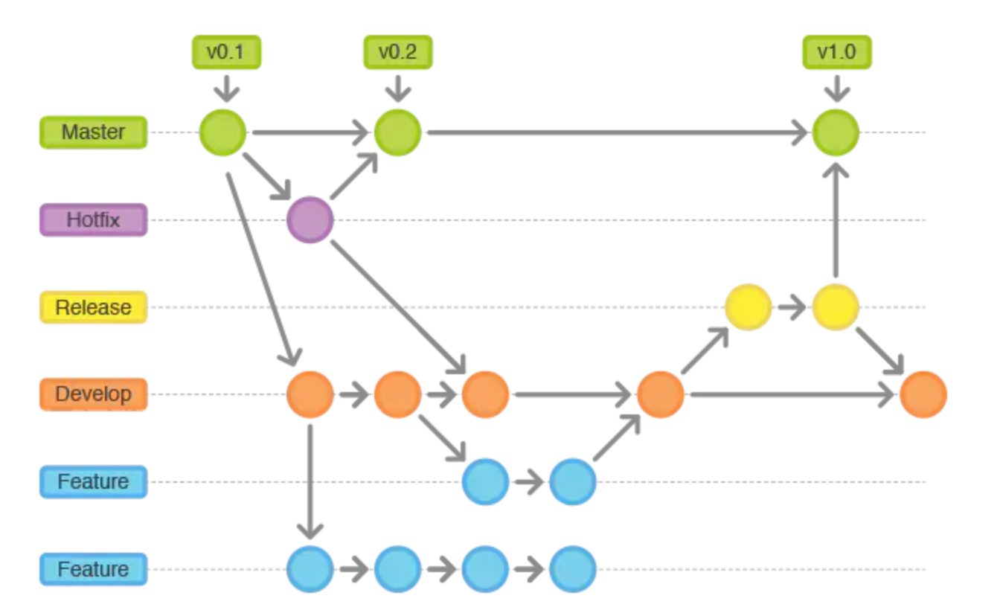

# CoverMore-Git

## GitFlow 常用分支
> 在 Git 流程工作流中，有五种不同的分支类: Master, Develop, Feature, Release, Hotfix。

### master
 - 主分支, 产品的功能全部实现后, 最终由master分支对外发布。
 - 该分支为只读唯一分支，只能从其他分支(release/hotfix)合并, 不能在此分支修改。
 - 所有在master的推送应该打标签做记录，方便追溯。

### develop
  - 主开发分支，基于`master`分支。
  - 包含所有要发布到下一个`release`的代码。
  - 该分支为只读唯一分支, 只能从其他分支合并。
  - feature功能分支完成, 合并到develop(此处合并应该创建 pull request)

### feature
  - 功能开发分支, 基于`develop`分支克隆 , 主要用于新需求新功能的开发。
  - 功能开发完毕后合到`develop`分支
  - feature分支可同时存在多个 , 用于团队中多个功能同时开发 , 属于临时分支 , 功能完成后可选删除

### release
  - 测试分支, 基于`feature`分支合并到`develop`之后, 从`develop`分支克隆。
  - 主要用于提交给测试人员进行功能测试, 测试过程中发现的BUG在本分支进行修复, 修复完成上线后合并到develop/master分支并推送(完成功能), 打Tag
  - 属于临时分支, 功能上线后可选删除。

### hotfix
  - 补丁分支, 基于`master`分支克隆, 主要用于对线上的版本进行BUG修复。
  - 修复完毕后分别合并到`develop`和`master`分支并推送, 打Tag。
  - 属于临时分支, 补丁修复上线后可选删除。

## Cmap 分支介绍

[[CoverMore CMS] Cover More Self-Service Technical Kick-off ](https://docs.google.com/presentation/d/1G_1yFEj5OC5tsOggdILy2IOhxou_X-kHccWtKCxP_HI/edit#slide=id.ge8a66e3430_0_4)

| Git Flow | Cmap                               | 描述                                                         |
| -------- | ---------------------------------- | ------------------------------------------------------------ |
| master   | `master`                             |                                                              |
| develop  | `develop`                            | from **master**                                              |
| feature  | `ADP-* `                           | from **develop** then merge into **develop**                 |
| release  | `Release-*` or `Sprint-*`|                                                              |
| hotfix   | `hotfix`                             | from **master** then merged into **master** and **development** |

> 这里 **release-2022625**, 其它组也有用 **Sprint-11** 命名的。

## Git Flow 命令示例

### 开始 Feature

